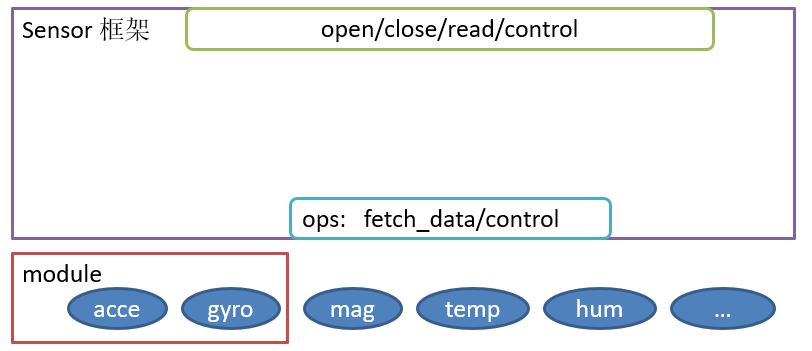
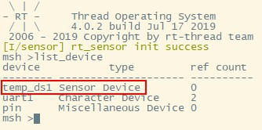
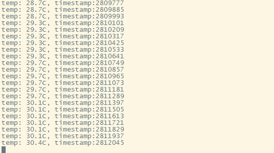
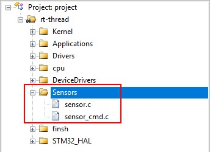

# 智能家居DIY教程连载（1）

> 如何正确使用 Sensor 框架

Hi~各位小伙伴们，距离 DIY 项目的发布已经有一周的时间了，第一周的任务已经完成了吗？会不会遇到了问题无从下手？没关系，这篇文章很好的解决了大家的困惑，一起来看看吧。

## 1. 第一周任务回顾

我们来回顾一下第一周安排的任务：

- 正确读取 ds18b20 温度数据
- 了解 RT-Thread 的 Sensor 框架，并将 ds18b20 对接到 Sensor 框架上
- 了解线程的使用，创建一个线程，在线程中读取温度数据，并通过FinSH控制台实时打印出来

上述任务的重点，其实不在于把温度读取到就好了的，重点在于如何将 ds18b20 对接到 RT-Thread 的 Sensor 框架上去。

Sensor 是物联网重要的一部分，“Sensor 之于物联网”相当于“眼睛之于人类”。人没有眼睛就看不到这大千的花花世界，物联网没有了 Sensor 更是不能感知这变化万千的世界。

现在，为物联网开发的 Sensor 已经很多了，不同的传感器厂商、不同的传感器都需要配套自己独有的驱动才能运转起来，这样在开发应用程序的时候就需要针对不同的传感器做适配，自然加大了开发难度。为了降低应用开发的难度，增加传感器驱动的可复用性，我们设计了 Sensor 驱动框架。

Sensor 驱动框架的作用是：为上层提供统一的操作接口，提高上层代码的可重用性；简化底层驱动开发的难度，只要实现简单的 ops(operations: 操作命令) 就可以将传感器注册到系统上。

本次 DIY 活动，以 ds18b20 温度传感器为例子，教大家如何正确使用 Sensor 框架。

## 2. Sensor 框架介绍



Sensor 框架的整体框架图如上。它为上层提供的是标准 device 接口 `open/close/read/write/control`，这些接口与上层用户程序对接，为底层驱动提供的是简单的 ops(operations: 操作命令)接口：`fetch_data/control`，这两个接口对接具体硬件的底层驱动。除此之外，Sensor 框架还支持 module(模块)，为底层存在耦合的传感器设备提供服务，如果，ds18b20 的底层不存在耦合，此处不需要用到 module。

Sensor 框架更多的介绍在 RT-Thread 的文档中心已有详细说明，这里不过多赘述，详情请查看[这](https://www.rt-thread.org/document/site/development-guide/sensor/sensor_driver/)

## 3. Sensor 框架的使用

看完文档中心的 Sensor 介绍后，相信大伙儿已经对这个框架有了一定的了解。有的小伙伴是不是早就按耐不住想要跃跃欲试将传感器对接到 Sensor 框架上？这里以 ds18b20 温度传感器为例子。

Sensor 框架的使用分两个步骤：ops 接口对接、传感器设备注册。

### 3.1 ops 接口对接

我们知道，Sensor 框架的接口分为上层接口和底层接口两种。将 ds18b20 的底层驱动对接到框架上，其实对接就是 Sensor 框架的底层接口，具体的，是底层的 ops 接口。

我们在 RT-Thread 源码中可以找到 Sensor 框架的源码，源码路径为：rt-thread\components\drivers\sensors，在 `sensor.h` 文件中，我们可以找到对 ops 接口的定义，有两个函数指针，`fetch_data` 和 `contorl`。

```.c
struct rt_sensor_ops
{
    rt_size_t (*fetch_data)(struct rt_sensor_device *sensor, void *buf, rt_size_t len);
    rt_err_t (*control)(struct rt_sensor_device *sensor, int cmd, void *arg);
};
```

`fetch_data` 作用是获取传感器数据，`control` 作用是通过控制命令控制传感器，ds18b20 并不支持 `control`，我们只需要实现 `fetch_data` 就好了。

Sensor 框架当前默认支持轮询(RT_DEVICE_FLAG_RDONLY)、中断(RT_DEVICE_FLAG_INT_RX)、FIFO(RT_DEVICE_FLAG_FIFO_RX) 这三种打开方式。需要在这里判断传感器的工作模式，然后再根据不同的模式返回传感器数据。我们以轮询的方式读取 ds18b20 的温度数据，那么 `fetch_data` 的实现如下：

```.c
static rt_size_t ds18b20_fetch_data(struct rt_sensor_device *sensor, void *buf, rt_size_t len)
{
    RT_ASSERT(buf);

    if (sensor->config.mode == RT_SENSOR_MODE_POLLING)
    {
        return _ds18b20_polling_get_data(sensor, buf);
    }
    else
        return 0;
}
```

具体的，`_ds18b20_polling_get_data(sensor, buf)` 的实现如下，其中，`ds18b20_get_temperature` 函数就是 ds18b20 温度传感器底层驱动的获取温度的函数。

```.c
static rt_size_t _ds18b20_polling_get_data(rt_sensor_t sensor, struct rt_sensor_data *data)
{
    rt_int32_t temperature_x10;
    if (sensor->info.type == RT_SENSOR_CLASS_TEMP)
    {
        temperature_x10 = ds18b20_get_temperature((rt_base_t)sensor->config.intf.user_data);
        data->data.temp = temperature_x10;
        data->timestamp = rt_sensor_get_ts();
    }    
    return 1;
}
```

因为不需要 `control`，我们直接让 `control` 返回 `RT_EOK` 即可

```.c
static rt_err_t ds18b20_control(struct rt_sensor_device *sensor, int cmd, void *args)
{
    rt_err_t result = RT_EOK;

    return result;
}
```

这样，我们的 ops 函数就写好了。然后，需要实现一个设备接口的结构体 ops 存储上面的接口函数：

```.c
static struct rt_sensor_ops sensor_ops =
{
    ds18b20_fetch_data,
    ds18b20_control
};
```

这样一来， ops 接口就对接成功了。

### 3.2 传感器设备注册

完成 Sensor 的 ops 的对接之后还要注册一个 Sensor 设备，这样上层才能找到这个传感器设备，进而进行控制。

设备的注册一共需要下面几步：

- 创建一个 rt_sensor_t 的结构体指针
- 为结构体分配内存
- 完成相关初始化

具体的，放到 ds18b20 上面来，具体实现如下：

```.c
int rt_hw_ds18b20_init(const char *name, struct rt_sensor_config *cfg)
{
    rt_int8_t result;
    rt_sensor_t sensor_temp = RT_NULL; 
    
    if (!ds18b20_init((rt_base_t)cfg->intf.user_data))
    {
        /* temperature sensor register */
        sensor_temp = rt_calloc(1, sizeof(struct rt_sensor_device));
        if (sensor_temp == RT_NULL)
            return -1;

        sensor_temp->info.type       = RT_SENSOR_CLASS_TEMP;
        sensor_temp->info.vendor     = RT_SENSOR_VENDOR_DALLAS;
        sensor_temp->info.model      = "ds18b20";
        sensor_temp->info.unit       = RT_SENSOR_UNIT_DCELSIUS;
        sensor_temp->info.intf_type  = RT_SENSOR_INTF_ONEWIRE;
        sensor_temp->info.range_max  = SENSOR_TEMP_RANGE_MAX;
        sensor_temp->info.range_min  = SENSOR_TEMP_RANGE_MIN;
        sensor_temp->info.period_min = 5;

        rt_memcpy(&sensor_temp->config, cfg, sizeof(struct rt_sensor_config));
        sensor_temp->ops = &sensor_ops;

        result = rt_hw_sensor_register(sensor_temp, name, RT_DEVICE_FLAG_RDONLY, RT_NULL);
        if (result != RT_EOK)
        {
            LOG_E("device register err code: %d", result);
            goto __exit;
        }

    }
    return RT_EOK;
    
__exit:
    if (sensor_temp)
        rt_free(sensor_temp);
    return -RT_ERROR;     
}
```

我们来解读一下。

传感器设备注册的第一步：创建一个 rt_sensor_t 的结构体指针，上述代码中是这么实现的：

```.c
rt_sensor_t sensor_temp = RT_NULL;
```

传感器设备注册的第二步：为结构体分配内存，上述代码中是这么实现的：

```.c
sensor_temp = rt_calloc(1, sizeof(struct rt_sensor_device));
if (sensor_temp == RT_NULL)
    return -1;
```

传感器设备注册的第三步：完成相关初始化，上述代码中是这么实现的：

```.c
sensor_temp->info.type       = RT_SENSOR_CLASS_TEMP;
sensor_temp->info.vendor     = RT_SENSOR_VENDOR_DALLAS;
sensor_temp->info.model      = "ds18b20";
sensor_temp->info.unit       = RT_SENSOR_UNIT_DCELSIUS;
sensor_temp->info.intf_type  = RT_SENSOR_INTF_ONEWIRE;
sensor_temp->info.range_max  = SENSOR_TEMP_RANGE_MAX;
sensor_temp->info.range_min  = SENSOR_TEMP_RANGE_MIN;
sensor_temp->info.period_min = 5;

rt_memcpy(&sensor_temp->config, cfg, sizeof(struct rt_sensor_config));
sensor_temp->ops = &sensor_ops;

```

传感器设备注册的三个步骤完成之后，就可以放心大胆地注册传感器设备了，上述代码中是这么实现的：

```.c
rt_hw_sensor_register(sensor_temp, name, RT_DEVICE_FLAG_RDONLY, RT_NULL);

```

上述的“ops 接口对接”和“传感器设备注册”两个工作完成后，就可以通过 Sensor 框架中的上层接口 `open/close/read/write/control`，对 ds18b20 进行操作了。

先不着急，我们在 FinSH 中输入 `list_device` 命令查看 ds18b20 温度传感器是否真的已经被注册上去了：



哇！成功将 ds18b20 注册成传感器设备了，可喜可贺！！！

传感器驱动对接 Sensor 框架的操作中的更多细节，请在 RT-Thread 的文档中心中[查看](https://www.rt-thread.org/document/site/development-guide/sensor/sensor_driver_development/)

## 4. 在线程中读取温度数据

我们通过一个线程，去实时获取 ds18b20 的温度数据。

线程的基本操作有：创建/初始化( rt_thread_create/rt_thread_init)、启动(rt_thread_startup)、运行(rt_thread_delay/rt_thread_control)、删除/脱离(rt_thread_delete/rt_thread_detach)。

之前我们已经将 ds18b20 对接到 ops 接口并成功注册成传感器设备了，接下来就可以利用 Sensor 框架的上层接口 `open/close/read/write/control` 对 ds18b20 进行操作了。

在 `main` 函数中创建一个读取 ds18b20 温度数据的线程并启动它，线程入口函数是 `read_temp_entry`：

```.c
rt_thread_t ds18b20_thread, led_thread;
    
ds18b20_thread = rt_thread_create("18b20tem",
                                  read_temp_entry,
                                  "temp_ds18b20",
                                  512,
                                  RT_THREAD_PRIORITY_MAX / 2,
                                  20);
if (ds18b20_thread != RT_NULL)
{
    rt_thread_startup(ds18b20_thread);
}

```

在线程入口函数 `read_temp_entry` 中，我们通过几个步骤，就可以读取 ds18b20 的温度数据了：

- 创建一个 rt_sensor_data 的数据结构体
- 查找传感器设备驱动
- 打开对应的传感器设备
- 读取传感器设备数据

上述步骤具体实现如下：

```.c
static void read_temp_entry(void *parameter)
{
    rt_device_t dev = RT_NULL;
    struct rt_sensor_data sensor_data;
    rt_size_t res;

    dev = rt_device_find(parameter);
    if (dev == RT_NULL)
    {
        rt_kprintf("Can't find device:%s\n", parameter);
        return;
    }

    if (rt_device_open(dev, RT_DEVICE_FLAG_RDWR) != RT_EOK)
    {
        rt_kprintf("open device failed!\n");
        return;
    }
    rt_device_control(dev, RT_SENSOR_CTRL_SET_ODR, (void *)100);

    while (1)
    {
        res = rt_device_read(dev, 0, &sensor_data, 1);
        if (res != 1)
        {
            rt_kprintf("read data failed!size is %d\n", res);
            rt_device_close(dev);
            return;
        }
        else
        {
            rt_kprintf("temp:%3d.%dC, timestamp:%5d\n", sensor_data.data.temp / 10, sensor_data.data.temp % 10, sensor_data.timestamp);
        }
        rt_thread_mdelay(100);
    }
}

```

通过 FinSH 控制台，查看该线程源源不断输出的数据：



温度数据在线程中被正确读取出来了，到此为止，本周任务就算是成功完成了的，因吹斯听~（^_^）

## 5. 开源代码

为了更进一步便于大家学习，第一周任务的代码已经开源啦~ [请点击这里查看](https://github.com/willianchanlovegithub/DIY_projects_base_on_RT-Thread)请给这个项目点个小星星(Star)^_^

获得更多官方技术支持，请添加 RT-Thread 小师妹为好友，备注`智能家居 DIY`，可拉进技术交流群。微信扫下方二维码添加好友：


## 6. 注意事项

- 欲使用 Sensor 框架，当然是要在 menuconfig 中将它开启啦：

```
RT-Thread Components  --->
    Device Drivers  --->
        [*] Using Sensor device drivers

```

- 打开之后，需要使用 `scons --target=mdk5` 更新工程即可。看，Sensor 框架加入到工程当中了：



- `stm32f407-atk-explorer` 文件夹里面的工程就是第一周的任务
- 是基于正点原子的探索者开发板的 BSP 制作的，手头有这款开发板的可以直接打开工程编译下载即可。使用其他开发板的，如果已经有 BSP 支持的，可以直接使用对应的 BSP 来做，并将 `stm32f407-atk-explorer\board\ports` 文件夹中的 `sensor_dallas_ds18b20.c` 文件引入到自己的工程当中即可。其余开发板，可以参考该 Demo 程序，照葫芦画瓢。