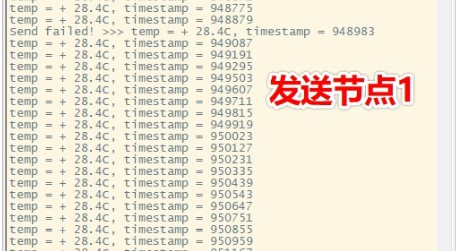
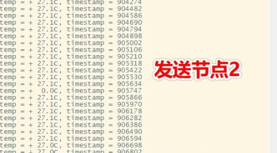
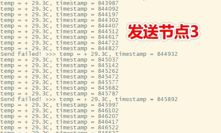
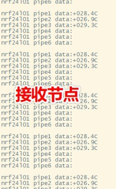

# 第二周任务清单

- 通过 ENV 工具获取 nrf24l01软件包，并加载到 MDK 工程里面
- 了解多线程间的通信，了解 IPC 中邮箱和消息队列的特性，并能灵活使用，实现 ds18b20 线程与 nrf24l01 线程之间的数据通信
- 修改 nrf24l01 软件包，实现多点通信功能

## 备注

- 第二周的 demo 工程中，ds18b20_thread 与 nrf24l01_thread 这两个线程之间的通信使用了 IPC 中的消息队列
- 因其他原因，公众号推文推迟到明天推送，请见谅。

## 结果

如下图所示：

好像看不太清。。。放大一下吧：
- 发送节点1数据：

- 发送节点2数据：

- 发送节点3数据：

- 接收节点数据：
