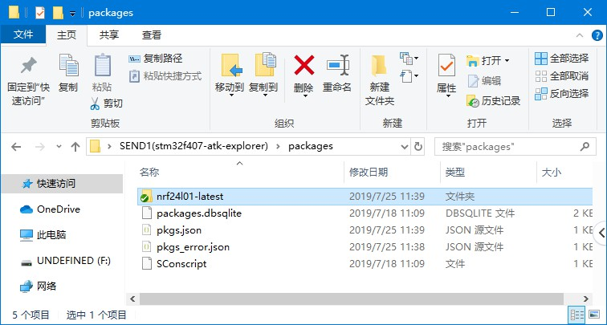
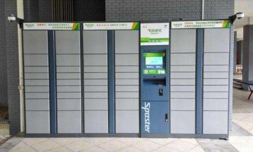
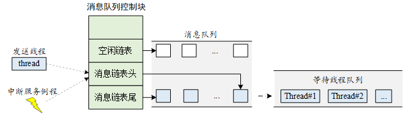
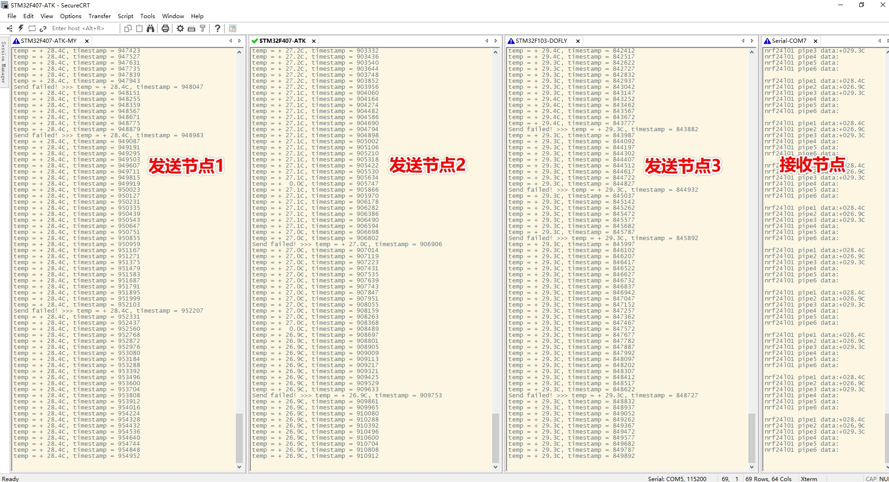
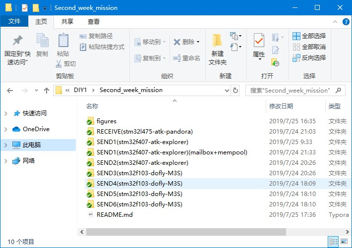

# 智能家居 DIY 教程连载（2）

> IPC 之消息队列与邮箱实战指南

千呼万唤始出来，智能家居 DIY 教程连载第二篇终于登场了！本文将重点给大家介绍如何将消息队列与邮箱运用到实际项目中去。一起来看看吧~

## 目录

本文文章目录如下，通过以下内容，给大家剖析第二周的任务重点难点。

- 1. 第二周任务回顾
- 2. 软件包的获取
- 3. IPC 之邮箱实战指南（重点）
  - 3.1 为什么要使用邮箱
  - 3.2 邮箱工作原理举例介绍
  - 3.3 在项目中运用邮箱
- 4. IPC 之消息队列实战指南（重点）
  - 4.1 为什么要使用消息队列
  - 4.2 消息队列工作原理举例介绍
  - 4.3 在项目中运用消息队列
- 5. nrf24l01 的多通道数据接收
- 6. 结果
- 7. 开源代码

## 1. 第二周任务回顾

我们来回顾一下第二周安排的任务：

- 通过 ENV 工具获取 nrf24l01软件包，并加载到 MDK 工程里面
- 了解多线程间的通信，了解 IPC 中邮箱和消息队列的特性，并能灵活使用，实现 ds18b20 线程与 nrf24l01 线程之间的数据通信
- 修改 nrf24l01 软件包，实现多点通信功能

上述任务的重点，是要学习去灵活运用邮箱和消息队列。

## 2. 软件包的获取

软件包可以通过 env 工具十分方便的获取到，并且加载到工程里面去，env 工具的下载链接可以在官网找到，[env 下载链接](https://www.rt-thread.org/page/download.html)。env 的使用方法可以查看[这里](https://www.rt-thread.org/document/site/tutorial/env-video/)进行学习。


值得注意的是，在 env 中获取软件包是需要依赖于 git 的，可以去 git 官网获得下载，[git 官网链接](https://git-scm.com/)

本周任务中，我们需要用到 nrf24l01 的软件包，只需要在 menuconfig 中选中 nrf24l01 即可：

```
RT-Thread online packages  --->
    peripheral libraries and drivers  --->
        [*] nRF24L01: Single-chip 2.4GHz wireless transceiver.  --->
```

选中之后需要将该软件包获取到本地来，在 env 中输入 `pkgs --update` 命令回车即可。我们在工程目录的 `packages` 目录下，可以看到，nrf24l01 软件包被获取到本地来了，如下图所示：



不过该软件包现在仅仅只是获取到本地，尚未加载到 MDK 工程当中来。我们在 env 中输入 `scons --target=mdk5` 命令回车即可，执行完该命令之后打开 MDK5 工程，发现 nrf24l01 软件包成功加载到工程里面去了，如下图所示：


## 3. IPC 之邮箱实战指南

### 3.1 为什么要使用邮箱

我们需要通过 nrf24l01 无线模块进行数据发送与接收，定义：通过 nrf24l01 发送数据的是发送节点，通过 nrf24l01 接收数据的是接收节点。（本 DIY 整个项目需要至少用到两个发送节点。）

在发送节点创建一个线程，用于无线发送数据。具体的，nrf24l01 的软件包提供了哪些 API，是如何通过这些 API 实现发送功能的，可以参考该软件包的 samples，路径为：...\packages\nrf24l01-latest\examples。

还记得第一周的任务吗？在 main 函数中创建了一个线程，用于获取 ds18b20 温度数据的。同理的，我们在 main 函数中再创建一个线程，该线程是用来通过 nrf24l01 发送数据的，线程入口函数是 `nrf24l01_send_entry`：

```.c
int main(void)
{
    rt_thread_t ds18b20_thread, nrf24l01_thread;
    
    ds18b20_thread = rt_thread_create("18b20tem", read_temp_entry, "temp_ds18b20",
                                      640, RT_THREAD_PRIORITY_MAX / 2, 20);
    if (ds18b20_thread != RT_NULL)
    {
        rt_thread_startup(ds18b20_thread);
    }
    
    nrf24l01_thread  = rt_thread_create("nrfsend", nrf24l01_send_entry, RT_NULL,
                                        1024, RT_THREAD_PRIORITY_MAX / 2, 20);
    if (nrf24l01_thread != RT_NULL)
    {
        rt_thread_startup(nrf24l01_thread);
    }
    
    return RT_EOK;
}
```

这时候，我们的程序当中就存在了两个线程了，`ds18b20_thread` 线程用来获取温度数据，`nrf24l01_thread` 线程用来向外无线发送温度数据，那么问题来了：
- `ds18b20_thread` 线程如何将温度数据给 `nrf24l01_thread` 线程？
- 如果`ds18b20_thread` 线程采集温度数据过快，`nrf24l01_thread` 线程来不及发送，怎么办？
- 如果`nrf24l01_thread` 线程发送数据过快，`ds18b20_thread` 线程来不及采集温度数据，怎么办？

这时候，IPC 中的邮箱（mailbox）可以很好的解决以上问题。不过这里，我们需要将邮箱与内存池（mempool）搭配一起使用。往往而言，在实际项目中，邮箱和内存池这两个 IPC 是经常需要配套着一起使用的。为什么，且慢慢看来。

### 3.2 邮箱工作原理举例介绍

RT-Thread 的文档中心已经有对邮箱和内存池原理上的详细讲解，请点击此[链接](https://www.rt-thread.org/document/site/programming-manual/ipc2/ipc2/)跳转至于邮箱，此[链接](https://www.rt-thread.org/document/site/programming-manual/memory/memory/)跳转至内存池。这里不在赘述。这里通过举一个生活中的例子，去帮助大家理解邮箱和内存池。

如今，很多人购物都是通过电商平台购买，那避免不了是要收快递的。



我们拟定一个生活场景。小区内放置有快递柜，快递柜里面有很多快递箱，快递箱里面可以存放快递，快递员把快递存放到快递箱之后，会发短信通知你过来取快递，还会告诉你编号是多少，通过编号你可以找到你的快递存放在快递柜的哪个快递箱里面。

上面这个模型中有几个名词，我们抽取出来：快递、快递柜、快递箱、快递员、你自己、短信、编号。

我们将上面这个生活场景和 IPC 中的邮箱和内存池一一对应起来：
- 快递：采集到的温度数据
- 快递柜：内存池
- 快递箱：内存池里面的内存块
- 快递员：`ds18b20_thread` 线程
- 你自己：`nrf24l01_thread` 线程
- 短信：邮箱中的一封邮件
- 编号：内存块地址指针

邮箱和内存池的使用，其实和上面那个收快递的生活场景是一样的：
- 在程度的一开始，即 main 函数中，我们创建一个邮箱和一个内存池
- 在`ds18b20_thread` 线程里：
  - 首先，每当该线程采集到一个温度数据（有快递来了），就在内存池里面申请一个内存块（快递员找一个空快递箱）
  - 然后，把本次采集到的这个温度数据放到内存块里（快递放入快递箱），再把内存块的地址放在邮箱里（快递编号）
  - 最后，邮件发送出去（发短信告知用户）
- 在`nrf24l01_thread` 线程里：
  - 首先，接收`ds18b20_thread` 线程发送过来的邮件（用户收到短信）
  - 然后，根据邮箱中的存放的地址，知道了当前温度数据存放在哪个内存块里面，也就是说，`nrf24l01_thread` 线程找到了（收到了）当前温度数据。（根据短信里的编号知道快递放在哪里了）
  - 最后，用完了这个内存块要及时释放掉（快递取出来了，快递箱空了）

### 3.3 在项目中运用邮箱

通过代码解读一下。

main 函数中创建一个邮箱和一个内存池是这么做的：

```.c
tmp_msg_mb = rt_mb_create("temp_mb0", MB_LEN, RT_IPC_FLAG_FIFO); /* 创建邮箱 */
tmp_msg_mp = rt_mp_create("temp_mp0", MP_LEN, MP_BLOCK_SIZE);    /* 创建内存池 */
```

`ds18b20_thread` 线程的入口函数是 `read_temp_entry`，如下：

```.c
static void read_temp_entry(void *parameter)
{
    struct tmp_msg *msg;
    rt_device_t dev = RT_NULL;
    rt_size_t res;

    dev = rt_device_find(parameter);
    if (dev == RT_NULL)
    {
        rt_kprintf("Can't find device:%s\n", parameter);
        return;
    }

    if (rt_device_open(dev, RT_DEVICE_FLAG_RDWR) != RT_EOK)
    {
        rt_kprintf("open device failed!\n");
        return;
    }
    rt_device_control(dev, RT_SENSOR_CTRL_SET_ODR, (void *)100);

    while (1)
    {
        res = rt_device_read(dev, 0, &sensor_data, 1);
        if (res != 1)
        {
            rt_kprintf("read data failed!size is %d\n", res);
            rt_device_close(dev);
            return;
        }
        else
        {
            /* 申请一块内存 要是内存池满了 就挂起等待 */
            msg = rt_mp_alloc(tmp_msg_mp, RT_WAITING_FOREVER);
            msg->timestamp = sensor_data.timestamp;
            msg->int_value = sensor_data.data.temp;
            rt_mb_send(tmp_msg_mb, (rt_ubase_t)msg);
            msg = NULL;
        }
        rt_thread_mdelay(100);
    }
}
```

在上述代码中，该线程采集到一个温度数据之后，就会在内存池中申请内存块：

```.c
msg = rt_mp_alloc(tmp_msg_mp, RT_WAITING_FOREVER);
```

将温度数据存放到刚刚申请到的内存块里面：

```.c
msg->int_value = sensor_data.data.temp;
```

将这个存放着温度数据的内存块的地址给邮箱，然后发送邮件：

```.c
rt_mb_send(tmp_msg_mb, (rt_ubase_t)msg);
```

`nrf24l01_thread` 线程的入口函数是 `nrf24l01_send_entry`，如下：

```.c
static void nrf24l01_send_entry(void *parameter)
{
    struct tmp_msg *msg;
    struct hal_nrf24l01_port_cfg halcfg;
    nrf24_cfg_t cfg;
    uint8_t rbuf[32 + 1] = {0};
    uint8_t tbuf[32] = {0};

    nrf24_default_param(&cfg);
    halcfg.ce_pin = NRF24L01_CE_PIN;
    halcfg.spi_device_name = NRF24L01_SPI_DEVICE;
    cfg.role = ROLE_PTX;
    cfg.ud = &halcfg;
    cfg.use_irq = 0;
    nrf24_init(&cfg);

    while (1)
    {
        rt_thread_mdelay(100);
        
        if (rt_mb_recv(tmp_msg_mb, (rt_ubase_t*)&msg, RT_WAITING_FOREVER) == RT_EOK)
        {
            if (msg->int_value >= 0)
            {
                rt_sprintf((char *)tbuf, "temp:+%3d.%dC, ts:%d",
                           msg->int_value / 10, msg->int_value % 10, msg->timestamp);
            }
            else
            {
                rt_sprintf((char *)tbuf, "temp:-%2d.%dC, ts:%d",
                           msg->int_value / 10, msg->int_value % 10, msg->timestamp);
            }
            rt_kputs((char *)tbuf);
            rt_kputs("\n");
            rt_mp_free(msg); /* 释放内存块 */
            msg = RT_NULL;   /* 请务必要做 */
        }
        if (nrf24_ptx_run(rbuf, tbuf, rt_strlen((char *)tbuf)) < 0)
        {
            rt_kputs("Send failed! >>> ");
        }
    }
}
```

在上述代码中，nrf24l01 软件包提供了发送数据的 API `nrf24_ptx_run`。

该线程接收`ds18b20_thread` 线程发送过来的邮件，并收到了温度数据：

```.c
rt_mb_recv(tmp_msg_mb, (rt_ubase_t*)&msg, RT_WAITING_FOREVER)
```

将温度数据发送出去：

```.c
nrf24_ptx_run(rbuf, tbuf, rt_strlen((char *)tbuf))
```

用完的内存块释放掉：

```.c
rt_mp_free(msg);
msg = RT_NULL;
```

还有两个问题没有解答：
- 如果`ds18b20_thread` 线程采集温度数据过快，`nrf24l01_thread` 线程来不及发送，怎么办？
- 如果`nrf24l01_thread` 线程发送数据过快，`ds18b20_thread` 线程来不及采集温度数据，怎么办？

这两个问题其实就是解决供过于求和供不应求的问题。

有没有留意到，申请内存块的代码上有一个 `RT_WAITING_FOREVER`，接收邮件的代码上也有一个 `RT_WAITING_FOREVER`。

这两个 `RT_WAITING_FOREVER` 就是用来解决上面两个问题的。

当内存池满了的时候，再也申请不到内存块了，这时候申请内存块里面的 `RT_WAITING_FOREVER` 会使得 `ds18b20_thread` 线程阻塞，并挂起，然后 MCU 就会去干别的事情去了，不断的在 `nrf24l01_thread` 线程中发送存放在内存池中的温度数据，并释放掉内存块。等一有内存块可以申请了，`ds18b20_thread` 线程被唤醒，又会往里面塞数据了。

同理的，如果内存池是空的，里面没有数据，接收邮件里面的 `RT_WAITING_FOREVER` 会使得`nrf24l01_thread` 线程阻塞，并挂起，然后 MCU 就会去干别的事情去了，在 `ds18b20_thread` 线程中采集温度，并申请内存块塞数据进去，内存块一旦有数据，就会发邮箱，另外一边一有邮箱收到了，就又开始工作了。

## 4. IPC 之消息队列实战指南

### 4.1 为什么要使用消息队列

在本次 DIY 中，消息队列其实也是用来解决以下问题的：
- `ds18b20_thread` 线程如何将温度数据给 `nrf24l01_thread` 线程？
- 如果`ds18b20_thread` 线程采集温度数据过快，`nrf24l01_thread` 线程来不及发送，怎么办？

### 4.2 消息队列工作原理举例介绍



消息队列一般来说，不需要搭配内存池一起使用，因为消息队列创建的时候会申请一段固定大小的内存出来，作用其实和邮箱+内存池是一样的。

每个消息队列对象中包含着多个消息框，每个消息框可以存放一条消息，每个消息框的大小是一样的，存放的消息大小不能超过消息框的大小，即可以相同，可以小于。

类比生活中的例子，存钱罐，发工资了（纸币），把一张张的钱放到存钱罐里去，你自己或者你对象需要花钱了，就从存钱罐里面取钱出来用。

更多对消息队列的讲解，请查看 RT-Thread 文档中心，点此[链接](https://www.rt-thread.org/document/site/programming-manual/ipc2/ipc2/#_13)跳转。

### 4.3 在项目中运用消息队列

因为文章篇幅原因，这里不把代码放出来了，可打开工程查看。工程源码是已经开源了的，链接会在下面给出。

在 main 函数中创建消息队列：

```.c
tmp_msg_mq = rt_mq_create("temp_mq", MQ_BLOCK_SIZE, MQ_LEN, RT_IPC_FLAG_FIFO);
```

在 `ds18b20_thread` 线程中转载数据并发送消息队列：

```.c
msg.int_value = sensor_data.data.temp;
rt_mq_send(tmp_msg_mq, &msg, sizeof msg);
```

在 `nrf24l01_thread` 线程中接收消息队列：

```.c
rt_mq_recv(tmp_msg_mq, &msg, sizeof msg, RT_WAITING_FOREVER)
```

上面这个 `RT_WAITING_FOREVER` 作用是为了解决下面这个问题，原理和邮箱中的介绍一样：
- 如果`ds18b20_thread` 线程采集温度数据过快，`nrf24l01_thread` 线程来不及发送，怎么办？

即而当消息队列是空的时候，可以挂起读取线程。当有新的消息到达时，挂起的线程将被唤醒以接收并处理消息。

## 5. nrf24l01 的多通道数据接收

nrf24l01 的多通道数据接收与其底层驱动相关，会在后期单独写一篇文章介绍放到 GitHub 上，敬请期待。

## 6. 结果



这里只是展示三个发送节点的情况，接收节点这边代码上已经把六个节点全部支持了。手头板子够多的话，把六个发送节点全部弄出来也是OK的。

## 7. 开源代码

为了更进一步便于大家学习，第二周任务的代码已经开源啦~ [请点击这里查看](https://github.com/willianchanlovegithub/DIY_projects_base_on_RT-Thread)请给这个项目点个小星星(Star)^_^

获得更多官方技术支持，请添加 RT-Thread 小师妹为好友，备注`智能家居 DIY`，可拉进技术交流群。微信扫下方二维码添加好友：


## 8. 注意事项



- RECEIVE(stm32l475-atk-pandora) 是接收节点的工程，支持6个数据通道接收数据
- SEND1(stm32f407-atk-explorer) 是发送节点1的工程，使用 nrf24l01 的通道0传输，消息队列 demo 工程
- SEND2(stm32f407-atk-explorer) 是发送节点2的工程，使用 nrf24l01 的通道1传输，消息队列 demo 工程
- SEND3(stm32f103-dofly-M3S) 是发送节点3的工程，使用 nrf24l01 的通道2传输，消息队列 demo 工程
- SEND4(stm32f103-dofly-M3S) 是发送节点4的工程，使用 nrf24l01 的通道3传输，消息队列 demo 工程
- SEND5(stm32f103-dofly-M3S) 是发送节点5的工程，使用 nrf24l01 的通道4传输，消息队列 demo 工程
- SEND6(stm32f103-dofly-M3S) 是发送节点6的工程，使用 nrf24l01 的通道5传输，消息队列 demo 工程
- SEND1(stm32f407-atk-explorer) (mailbox+mempool)是发送节点1的工程，使用 nrf24l01 的通道0传输，邮箱+内存池 demo 工程

