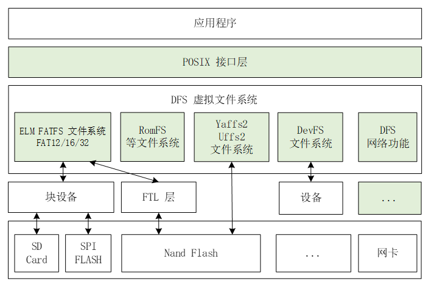
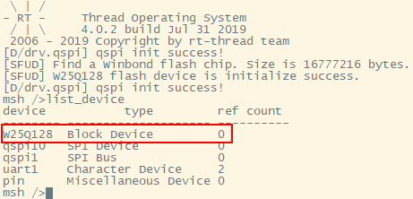
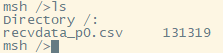
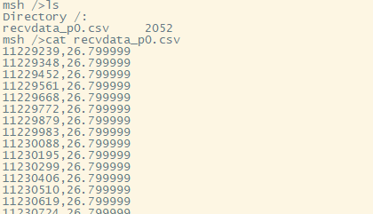
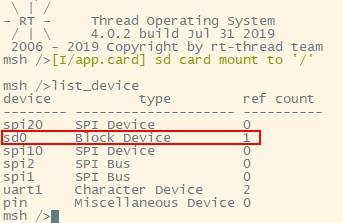
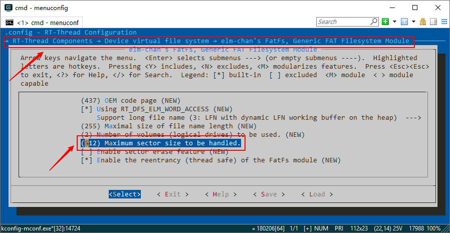

# 智能家居 DIY 教程连载（3）

> 文件系统 so easy

Hi，各位小伙伴，DIY 活动已经来到了第三周！前两周的任务大家都完成了吗？本周将会迎来新的挑战——文件系统。本文将从 SPI Flash 和 SD Card 两方面给大家讲解如何使用文件系统，以及针对本次 DIY 做出的一些优化，会大大增强系统性能，一起来看看吧~

## 本文目录

- 1. 第三周任务回顾
- 2. RT-Thread 文件系统简要介绍
- 3. 在 SPI Flash 上使用文件系统
- 4. 在 SD Card 上使用文件系统
- 5. 针对本次 DIY 的一些系统性能优化（**重点**）
- 6. 开源代码
- 7. 注意事项

## 1. 第三周任务概览

我们来回顾一下第三周的任务：

- 了解 RT-Thread 文件系统，在接收节点中使用文件系统，存放来自发送节点发送过来的数据

上述任务比较单一，只是文件系统而已。不过，能巧妙灵活的把文件系统用好用对，可不是一件轻松的事情。

## 2. RT-Thread 文件系统简要介绍

DFS 是 RT-Thread 提供的虚拟文件系统组件，全称为 Device File System，即设备虚拟文件系统，文件系统的名称使用类似 UNIX 文件、文件夹的风格。

RT-Thread DFS 组件的主要功能特点有：

- 为应用程序提供统一的 POSIX 文件和目录操作接口：read、write、poll/select 等。
- 支持多种类型的文件系统，如 FatFS、RomFS、DevFS 等，并提供普通文件、设备文件、网络文件描述符的管理。
- 支持多种类型的存储设备，如 SD Card、SPI Flash、Nand Flash 等。

DFS 的层次架构如下图所示，主要分为 POSIX 接口层、虚拟文件系统层和设备抽象层。如下图：



DFS 的更多内容，请在 [RT-Thread 文档中心](https://www.rt-thread.org/document/site/)中查看，亦可点击本[链接](https://www.rt-thread.org/document/site/programming-manual/filesystem/filesystem/)跳转。这里不过多赘述。

## 3. 在 SPI Flash 上使用文件系统

### 3.1 准备工作

以正点原子的潘多拉开发板 (Iot Board) 为例，教大家在 SPI Flash 上使用文件系统。

值得一提的是，RT-Thread 已经将 libc 那套文件系统接口对接到 DSF 上了，在 env 工具中开启 libc 和 DFS 即可，本次教程使用 libc 的那套接口进行文件的打开/关闭、读取/写入。

在 menuconfig 中开启 libc：

```
RT-Thread Components  --->
    POSIX layer and C standard library  --->
        [*] Enable libc APIs from toolchain
```

在 meunconfig 中开启 DFS，本教程使用 elmfatfs 文件系统，需要将 elmfatfs 挂载到 RT-Thread 的 DFS 上，所以 elmfatfs 也要开启：

```
RT-Thread Components  --->
    Device virtual file system  --->
        [*] Using device virtual file system
        [*]   Enable elm-chan fatfs
```

当然，不要忘记在 meunconfig 中开启 SPI Flash：

```
Hardware Drivers Config  --->
    Onboard Peripheral Drivers  --->
        [*] Enable QSPI FLASH (W25Q128 qspi1)
```

潘多拉开发板上的 SPI Flash 使用的是 QSPI 接口，还需要在 meunconfig 中把 QSPI 接口开启：

```
Hardware Drivers Config  --->
    On-chip Peripheral Drivers  --->
        [*] Enable QSPI BUS
```

退出 menuconfig 后需要输入 “scons --target=mdk5” 更新工程。

### 3.2 文件系统的挂载

本次 DIY 使用的文件系统是 elmfatfs，elmfatfs 需要在块设备上才能进行文件操作。潘多拉板子上的 SPI Flash 是 W25Q128，我们需要将 W25Q128 注册成块设备，才能使用 elmfatfs 进行文件操作。如下示例代码：

```.c
static int rt_hw_qspi_flash_with_sfud_init(void)
{
    stm32_qspi_bus_attach_device("qspi1", "qspi10", RT_NULL, 4, w25qxx_enter_qspi_mode, RT_NULL);
    if (RT_NULL == rt_sfud_flash_probe("W25Q128", "qspi10"))
        return -RT_ERROR;
    return RT_EOK;
}
INIT_COMPONENT_EXPORT(rt_hw_qspi_flash_with_sfud_init);
```

在 FinSH 中输入 “list_decive”，即可看到 W25Q128 注册成了块设备了，并挂载在 QSPI 上：



W25Q128 注册成了块设备后，就能将 elmfatfs  这个文件系统挂载到 RT-Thread 的 DFS 上了，如下示例代码：

```.c
dfs_mount("W25Q128", "/", "elm", 0, 0)
```

### 3.3 文件操作

到此为止，我们就可以使用 libc 的接口进行文件操作了，将接收到的数据以文件方式存放到 W25Q128 里面去，举个简单的例子，如下示例代码：

```.c
FILE *recvdata_p0;
recvdata_p0 = fopen("recvdata_p0.csv", "a+");
if (recvdata_p0 != RT_NULL)
{
    fputs((char *)RxBuf_P0, recvdata_p0);
    fputs("\n", recvdata_p0);
    fclose(recvdata_p0);
}
```

在 Finsh 中输入 “ls” 可以查看当前文件系统中的文件目录，如下图：



输入 “cat XXX” 可以查看文件内容，如下图：



简单的几步就可以进行文件操作了，RT-Thread 的文件系统还是相当易用的。

## 4. 在 SD Card 上使用文件系统

### 4.1 准备工作

以正点原子的潘多拉开发板 (Iot Board) 为例，教大家在 SD Card 上使用文件系统。

和上面的 SPI Flash 一样，在 menuconfig 中开启相关选项：SD Card，SPI（潘多拉板子的 SD 卡是用 SPI 驱动的而不是 SDIO），libc，DFS，elmfatfs。

### 4.2 文件系统的挂载

与 SPI Flash 一样，需要将 SD Card 注册成块设备，才能挂载文件系统。如下示例代码：

```.c
static int rt_hw_spi1_tfcard(void)
{
    __HAL_RCC_GPIOC_CLK_ENABLE();
    rt_hw_spi_device_attach("spi1", "spi10", GPIOC, GPIO_PIN_3);
    return msd_init("sd0", "spi10");
}
INIT_DEVICE_EXPORT(rt_hw_spi1_tfcard);
```

在 FinSH 中输入 “list_decive”，即可看到 SD Card 注册成了块设备了，并挂载在 SPI 上：



SD Card 注册成了块设备后，就能将 elmfatfs  这个文件系统挂载到 RT-Thread 的 DFS 上了，如下示例代码：

```.c
dfs_mount("sd0", "/", "elm", 0, 0)
```

**需要注意的是**，如果大家手头的板子是使用 SDIO 接口来驱动 SD Card 的，那么将 SD Card 注册成块设备将不用我们操心，RT-Thread 源码中的 “...rt-thread\components\drivers\sdio\block_dev.c” 文件中，会将 SD Card 注册成块设备的。当然，文件系统的挂载还是需要我们手动敲代码去实现的。

### 4.3 文件操作

与 SPI Flash 一样，可以直接使用 libc 的接口进行文件操作，如下示例代码：

```.c
FILE *recvdata_p0;
recvdata_p0 = fopen("recvdata_p0.csv", "a+");
if (recvdata_p0 != RT_NULL)
{
    fputs((char *)RxBuf_P0, recvdata_p0);
    fputs("\n", recvdata_p0);
    fclose(recvdata_p0);
}
```

## 5. 针对本次 DIY 的一些优化

### 5.1 优化1

将文件系统用起来，进行文件操作，是一件相对比较容易的事情。不过当将文件系统运用到实际项目中的时候，往往会因为一些需求或者说是其他因素，导致事情不那么好办。就拿这个 DIY 来说，如果就像上面的示例代码这么用文件系统，虽然系统能正常工作，但是会带来一些问题：

- 众所周知，文件的操作是需要占用大量时间和资源的，通俗来说就是慢，像文件的读，写，打开，创建等，都是比较慢的。如果发送节点发数据过来，接收节点每收到一条数据，就用文件系统记录这个数据，这样会导致系统性能下降。如何保证减少文件操作次数，提高系统性能，又能保证每条数据都不丢失呢？

这里使用 ringbuffer 来避免这个问题。

ringbuffer 是一种先进先出的 FIFO 环形缓冲区，DIY 的接收节点工程中，我们创建了两个线程去工作，一个是 `nrf24l01_thread` 线程，用于接收来自发送节点的数据，另一个是 `DFS_thread` 线程，用于利用文件系统保存数据的。并且创建一个 4KB 大小的一个 ringbuffer：

```.c
static struct rt_ringbuffer *recvdatabuf;
recvdatabuf = rt_ringbuffer_create(4069); /* ringbuffer的大小是4KB */
```

每当 `nrf24l01_thread` 线程接收到一条数据，就存放到 ringbuffer 中去：

```.c
rt_ringbuffer_put(recvdatabuf, (rt_uint8_t *)str_data, strlen(str_data));
```
在`DFS_thread` 线程中，我们设置一个 ringbuffer 的阈值，这里我将阈值设置成了 ringbuffer 大小的一半，当写入的数据达到了 ringbuffer 的阈值之后，就将 ringbuffer 中所有的数据统统写入文件中去：

```.c
/* 判断写入的数据大小到没到所设置的ringbuffer的阈值 */
if (rt_ringbuffer_data_len(recvdatabuf) > (4096 / 2))
{
    /* 到阈值就直接写数据 */
    recvdatafile_p0 = fopen("recvdata_p0.csv", "ab+");
    if (recvdatafile_p0 != RT_NULL)
    {
        while(rt_ringbuffer_data_len(recvdatabuf))
        {
            size = rt_ringbuffer_get(recvdatabuf, (rt_uint8_t *)writebuffer, (4096 / 2));
            fwrite(writebuffer, 1, size, recvdatafile_p0);
        }
        fclose(recvdatafile_p0);
    }
}
```

这么做，就可以尽可能的减少了文件的操作，提高了系统的性能，同时又保证每一条数据都不会丢失。

### 5.2 优化2

**但是，还有一个问题：**

- 如果发送节点很久很久才发数据过来，或者说是接收节点很久很久才收到数据，那么 ringbuffer 要很久很久才能到阈值。如果这时候，已经写了整整一天的数据进 ringbuffer 中了，只差一点点就要到阈值了，很快就可以将数据写入到文件中去了，这时候偏偏断电了！整整一天的数据白白丢失了，心痛吗？

当然，掉电丢数据这种情况是不可以避免的，但是我们可以通过一些算法优化（姑且叫它算法吧），尽可能的减少丢失数据的可能。

解决思路是：定个固定时间，计时，如果时间一到，此时数据还没写满 ringbuffer 的阈值，这时候就不管数据到没到阈值了，直接将 ringbuffer 里的数据全部写入文件中去。要实现这个思路需要搭配事件集 (event) 使用。

在 `nrf24l01_thread` 线程中，每收到一个数据，就发送一个事件：

```.c
while (1)
{
    if (!rx_pipe_num_choose())
    {
        /* 通过sscnaf解析收到的数据 */
        if(sscanf((char *)RxBuf_P0, "%d,+%f", &buf.timestamp, &buf.temperature) != 2)
        {
            /* 通过sscnaf解析收到的数据 */
            if(sscanf((char *)RxBuf_P0, "%d,-%f", &buf.timestamp, &buf.temperature) != 2)
            {
                continue;
            }
            buf.temperature = -buf.temperature;
        }
        sprintf(str_data, "%d,%f\n", buf.timestamp, buf.temperature);
        /* 将数据存放到ringbuffer里 */
        rt_ringbuffer_put(recvdatabuf, (rt_uint8_t *)str_data, strlen(str_data));
        /* 收到数据，并将数据存放到ringbuffer里后，才发送事件 */
        rt_event_send(recvdata_event, WRITE_EVENT);
    }
    rt_thread_mdelay(30);
}
```

在`DFS_thread` 线程中，通过接收两次事件，并设置接收事件的超时时间，达到计时的目的：

```.c
while (1)
{
    /* 接收感兴趣的事件WRITE_EVENT，以永久等待方式去接收 */
    if (rt_event_recv(recvdata_event, WRITE_EVENT, RT_EVENT_FLAG_OR | RT_EVENT_FLAG_CLEAR, RT_WAITING_FOREVER, &set) != RT_EOK)
        continue;
    do
    {
        /* 接收感兴趣的事件WRITE_EVENT，以1000ms超时方式接收 */
        if (rt_event_recv(recvdata_event, WRITE_EVENT, RT_EVENT_FLAG_OR | RT_EVENT_FLAG_CLEAR, rt_tick_from_millisecond(1000), &set) == RT_EOK)
        {
            /* 判断写入的数据大小到没到所设置的ringbuffer的阈值 */
            if (rt_ringbuffer_data_len(recvdatabuf) > THRESHOLD)
            {
                /* 到阈值就直接写数据 */
                recvdatafile_p0 = fopen("recvdata_p0.csv", "ab+");
                if (recvdatafile_p0 != RT_NULL)
                {
                    while(rt_ringbuffer_data_len(recvdatabuf))
                    {
                        size = rt_ringbuffer_get(recvdatabuf, (rt_uint8_t *)writebuffer, THRESHOLD);
                        fwrite(writebuffer, 1, size, recvdatafile_p0);
                    }
                    fclose(recvdatafile_p0);
                }
            }
            /* 阈值没到就继续接收感兴趣的事件WRITE_EVENT，以1000ms超时方式接收 */
            continue;
        }
        /* 1000ms到了，还没有收到感兴趣的事件，这时候不管到没到阈值，直接写 */
        recvdatafile_p0 = fopen("recvdata_p0.csv", "ab+");
        if (recvdatafile_p0 != RT_NULL)
        {
            while(rt_ringbuffer_data_len(recvdatabuf))
            {
                size = rt_ringbuffer_get(recvdatabuf, (rt_uint8_t *)writebuffer, THRESHOLD);
                fwrite(writebuffer, 1, size, recvdatafile_p0);
            }
            fclose(recvdatafile_p0);
        }
    } while(0);
}
```

这样就尽最大力度的解决了掉电丢失数据的可能了。当然，第二次接收事件的超时时间可以根据自己需求设定长短。

## 6. 开源代码

为了更进一步便于大家学习，第三周任务的代码已经开源啦~ [请点击这里查看](https://github.com/willianchanlovegithub/DIY_projects_base_on_RT-Thread)请给这个项目点个小星星(Star)^_^

获得更多官方技术支持，请添加 RT-Thread 小师妹为好友，备注`智能家居 DIY`，可拉进技术交流群。微信扫下方二维码添加好友：


## 7. 注意事项

- 第三周的源码中，只上传了两个 demo 工程，均是本次 DIY 中接收节点的代码
  - RECEIVE(stm32l475-atk-pandora)(SD_Card) 是在 SD Card 上使用文件系统的 demo
  - RECEIVE(stm32l475-atk-pandora)(SPI_Flash) 是在 SPI Flash 上使用文件系统的 demo
  
- 发送节点的代码，在第二周的 demo 工程中有，这里不再重复上传相同 demo 工程

- SPI Flash 的 sector 大小为 4096 字节，需要在 menuconfig 中修改：

  
  
- SD Card 的 sector 大小为 512 字节，需要在 menuconfig 中修改：

  